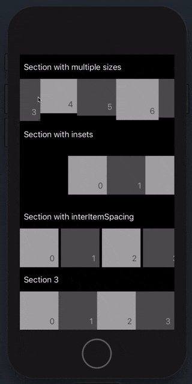

# JEKScrollableSectionCollectionViewLayout

A drop-in replacement of `UICollectionViewFlowLayout` which allows horizontally scrolling sections.
Uses UICollectionViewDelegateFlowLayout to query layout information, so usually no code changes
are needed to replace your current flow layout with this one.

Note however that this is _not_ a subclass of `UICollectionViewFlowLayout`, so it might not respond
to certain messages, for example `estimatedItemSize` which is not implemented (yet). This also
means that it will not read measurements set in interface builder on a `UICollectionViewFlowLayout`,
and you have to set the measurements in code. Check the example project for a full setup.



## Features
- Properly supports inserts/deletes/moves (even between different sections)
  - ... since it does not create multiple `UICollectionView`s like this problem is normally solved
- (almost) drop in replacement for `UICollectionViewFlowLayout`
- A simple layout object - doesn't need to subclass or modify `UICollectionView` in any way
  - ... leading to efficient reuse of cells and support for prefetching
- Section background views (as optional supplementary views)

## Installation
- CocoaPods: `pod 'JEKScrollableSectionCollectionViewLayout'`
- Simply copy `JEKScrollableSectionCollectionViewLayout.h/.m` into your project

## Planned features
- Support for `sectionHeadersPinToVisibleBounds`

## Section backgrounds
The layout has support for showing background views behind each seaction.
To enable it, you have to set `layout.showsSectionBackgrounds = YES` when setting
up your layout object.

Then, `collectionView:viewForSupplementaryElementOfKind:atIndexPath:` will be called
in your data source with the `JEKCollectionElementKindSectionBackground` kind. Dequeue
and return a view like you would normally with section headers and footers.

## Observing section scrolling
The `JEKCollectionViewDelegateScrollableSectionLayout`-protocol allows you to observe
and manipulate scrolling per horizontal section. To use it, simply conform to this protocol
instead of `UICollectionViewDelegateFlowLayout` (which is then implicitly conformed).

The protocol closely resembles `UIScrollViewDelegate` and exposes the following optional methods:
```objc
- (void)collectionView:(UICollectionView *)collectionView layout:(JEKScrollableSectionCollectionViewLayout *)layout section:(NSUInteger)section didScrollToOffset:(CGFloat)horizontalOffset;
- (void)collectionView:(UICollectionView *)collectionView layout:(JEKScrollableSectionCollectionViewLayout *)layout sectionWillBeginDragging:(NSUInteger)section;
- (void)collectionView:(UICollectionView *)collectionView layout:(JEKScrollableSectionCollectionViewLayout *)layout sectionWillEndDragging:(NSUInteger)section withVelocity:(CGFloat)velocity targetOffset:(inout CGFloat *)targetHorizontalOffset;
- (void)collectionView:(UICollectionView *)collectionView layout:(JEKScrollableSectionCollectionViewLayout *)layout sectionDidEndDragging:(NSUInteger)section willDecelerate:(BOOL)decelerate;
- (void)collectionView:(UICollectionView *)collectionView layout:(JEKScrollableSectionCollectionViewLayout *)layout sectionWillBeginDecelerating:(NSUInteger)section;
- (void)collectionView:(UICollectionView *)collectionView layout:(JEKScrollableSectionCollectionViewLayout *)layout sectionDidEndDecelerating:(NSUInteger)section;
```

## Usage example
Since this is a drop-in replacement for `UICollectionViewFlowLayout`, normally
you can just change the layout object in your current flow-layout based collection views.

Here's an example of a bare minimum `UICollectionViewController` with two horizontal sections.

```swift
class MyViewController: UICollectionViewController {

    override func viewDidLoad() {
        super.viewDidLoad()
        let layout = JEKScrollableSectionCollectionViewLayout()
        layout.itemSize = CGSize(width: 50, height: 50);
        layout.headerReferenceSize = CGSize(width: 0, height: 22)
        layout.minimumInteritemSpacing = 5
        collectionView.collectionViewLayout = layout

        collectionView.register(UICollectionViewCell.self, forCellWithReuseIdentifier: "cell")
        collectionView.register(UICollectionReusableView.self, forSupplementaryViewOfKind: UICollectionView.elementKindSectionHeader, withReuseIdentifier: "header")
    }

    override func numberOfSections(in collectionView: UICollectionView) -> Int {
        return 2
    }

    override func collectionView(_ collectionView: UICollectionView, numberOfItemsInSection section: Int) -> Int {
        return 10
    }

    override func collectionView(_ collectionView: UICollectionView, cellForItemAt indexPath: IndexPath) -> UICollectionViewCell {
        let cell = collectionView.dequeueReusableCell(withReuseIdentifier: "cell", for: indexPath)
        cell.backgroundColor = UIColor.gray
        return cell
    }

    override func collectionView(_ collectionView: UICollectionView, viewForSupplementaryElementOfKind kind: String, at indexPath: IndexPath) -> UICollectionReusableView {
        let header = collectionView.dequeueReusableSupplementaryView(ofKind: kind, withReuseIdentifier: "header", for: indexPath)
        header.backgroundColor = UIColor.blue
        return header
    }
}
```
